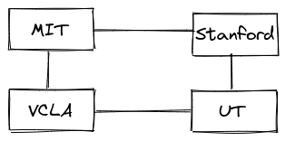
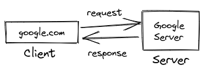
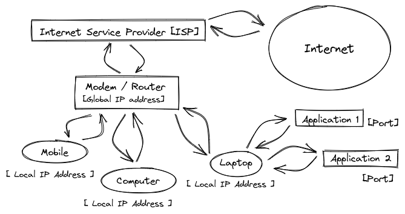
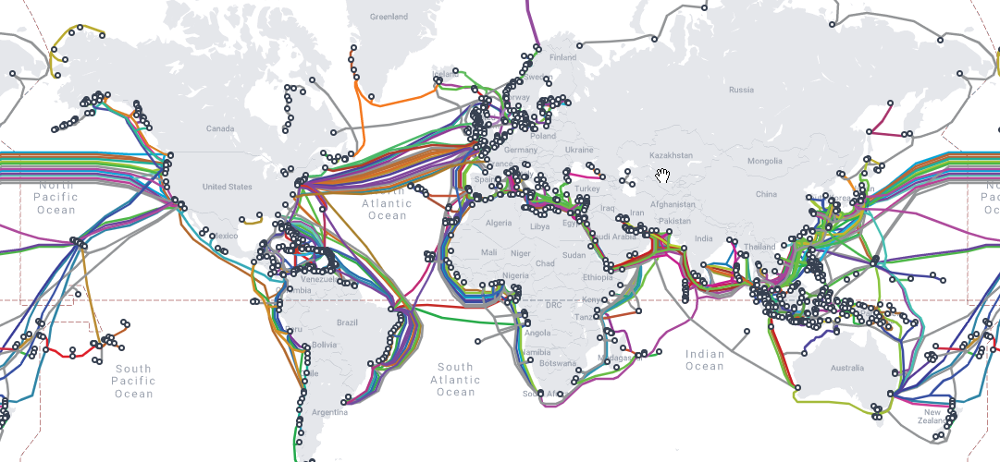
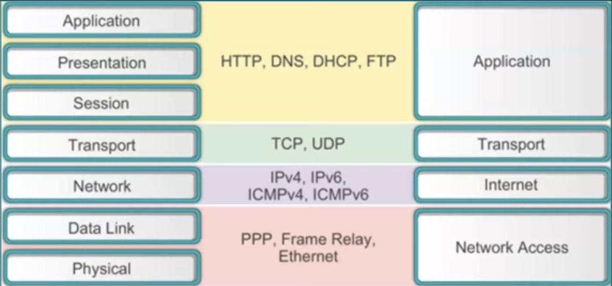
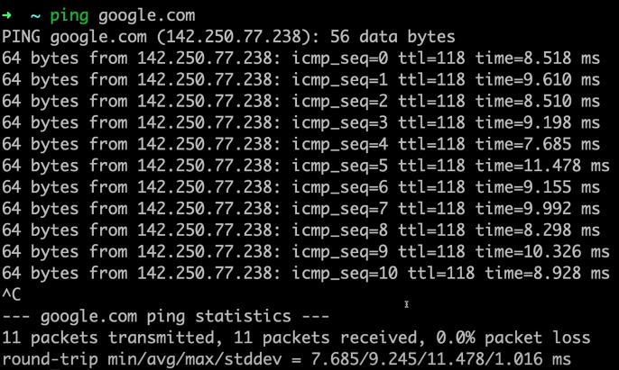

# Networking

# Introduction

**Computer** stands for **Common Operating Machine Purposely Used for Technological & Education Research**.

**Networking** is the **connection of one computer to another**.

**Internet** is the **interconnection of computers globally.**

- How did the internet start?
    - After losing the first satellite to reach the earth’s atmosphere to Russia. The US Government created a program named “A.R.P.A” which stand for Advanced Research Projects Agency. A.R.P.A was made responsible to make discoveries so that the US does not remain behind. It needed a way to communicate with each other, A.R.P.A.N.E.T which stands for **Advanced Research Projects Agency Network** was built in 4 different places.
        
        
        
    
    - For transfer of files, require some steps. Different types of files would be transferred, would require different rules. These **rules which are set up for the successful transfer of files** is called **Protocols** [like Transfer Control Protocol[T.C.P]].
    - Many people tried to share their research papers, but it was unsuccessful because there was no way to link between research papers.
    - Then the **World Wide Web [W.W.W] was developed by Tim Burners Lee, where resources are identified by U.R.L [Uniform Resource Locator] and were inter-linked by Hyper-Links.**
- The Protocols are created and maintained by the Internet Society.
- How does a website work?
    - When opening a website, the **client** sends a request to the **server**, the server then responds to the client.
        
        
        
    - This sends a request and response, also requiring protocols like HyperText Transfer Protocol [H.T.T.P].
    - How is data transferred?
        - Data is transferred in small parts called **Packets.**
    - How does the client decide on a server to request to?
        
        
        
        - Each client has its own **IP address** [X.X.X.X [where X → 0 - 255] ].
            
            ```java
            $ curl ifconfig.me -s
            103.87.140.220
            ```
            
    
    - All the **local IP addresses are assigned to different devices, according to Dynamic Host Configuration Protocol** [D.H.C.P].
        - A device requires IP Address to request the ISP [Internet Service Provider] allow access to the internet.
        - If a request is made to a server, only the Global IP Address is visible. When the server responds, then **the router will send the data to the local IP Address which made the request using** **Network Access Translator** [N.A.T].
        - If a device changes the network, IP Address also changes.
        - IPv4 & IPv6
    - When the requested data is received by a device, **the device sends this data to the application which made the request using the** **Port** number.
    - Port are 16-bit numbers, which means there are $2^{16} \approx 65,000$ possible ports [like HTTP has default port 80, SQL has default port 1433].
    Ports 0 → 1023 are reserved ports, 1024 → 49152 are for applications & the remaining for any use.
    - The location of the device is determined by IP Address.
    The Application is determined by Port .qnumber.
    - The **Modem** is used to **convert digital signals to analogue signals**.
    The **Router** is a **device that routes the data packets based on their IP Addresses**.
        
        
- How is the speed of Internet Service Provider measured?
    - Sending data to the Internet is called **Uploading**.
    Receiving data from the Internet is called **Downloading.**
    - Speed is of two types Download & Upload speed:
        - 1 Kbps → 1000 bits
        - 1 Mbps → 1000 Kbps
        - 1 Gbps → 1000 Mbps
- 2 Types of Communication are :
    - **Guided Way [using cables]**
    - **Unguided Way [using wireless like WiFi, Blue-Tooth]**
- How are countries inter-connected?
    - Wires running under oceans keep the countries inter-connected.
        
        
        
                
        
        Google owns a large part of these wires.
        

## Types of Area Networks :

### **Local Area Network [L.A.N] :**

- It covers a **very small geographical area** like homes, hospitals & schools and is privately owned.
- It offers **high speed for data transfer** like 100 → 1000 Mbps.
- It has a **very short propagation delay**.
- It is also very secure.
- It is **easy to design, maintain and requires in-expensive hardware**.

### **Metropolitan Area Network [M.A.N] :**

- It **inter-connects LANs**.
- It covers **significant geographical areas** like cities.
- It sometimes **serves as an Internet Service Provider.**
- It is **hard to design, maintain and is costly** so it may be or may not be owned by a single organisation.
- It is designed for customers, to have **high-speed connectivity**.
- Its **delay and data transfer are moderate**.

### **Wide Area Network [W.A.N] :**

- It **inter-connects MANs**.
- It covers **large geographical areas** like states, countries.
- It is **relatively expensive**.
- It has a **data rate slow** as it involves log-distance transmission.
- It has **slow speeds** [a few Kbps → Mbps].

## Open System Interconnection [O.S.I] Model :

- It is a model for understanding and designing a network architecture by the ISO [International Standards Organization].
- It is not a protocol.
- It is used to facilitate communication between different systems without requiring changes to the logic of the underlying hardware and software.
- Aims of OSI model :
    1. A layer should be created where a different abstraction is needed.
    2. Each layer should perform a well-defined function.
    3. The function of each layer should be chosen with an eye toward
    defining internationally standardised protocols.
    4. The layer boundaries should be chosen to minimize the information
    flow across the interfaces.
    5. The number of layers should be large enough that distinct functions need not be thrown together in the same layer out of necessity and small enough that the architecture does not become unwieldy.


- To remember the order of the layers use **“Please** [Physical] **Do** [Data-link] **Not** [Network] **Throw** [Transfer] **Sausage** [Session] **Pizza** [Presentation] **Away** [Application]**”.**

### **Application Layer**

- It is **implemented by the network applications**.

### **Presentation Layer**

- It will receive the data from the application layer and is extracted and **manipulated as per the required format to transmit over the network.**
- **Translation:** It **converts the data given by the user to machine code** [ASCII → EBCDIC]
- **Encryption/Decryption:** The data also goes through **encryption** so that it is only readable to whom the data is being sent.
- **Compression:** The data also gets **compressed**.

### **Session Layer**

- This layer is responsible for the establishment of connection, maintenance of sessions, authentication and also ensures security.
- **Connection-Oriented Service :**
    - Connection Establishment
    - Data Transfer is transferred without any loss
    - Termination of the Connection
    - It also allows to send a acknowledgement after successful transfer of data to the sender.
    - Eg. Downloading Files
- **Connection-less Service :**
    - **Connection-less Service allows much faster communication** between devices as it is a one-phase process.
    - Data Transfer with some loss of data.
    - Eg. Video Conference, Gaming

### **Transport Layer**

- It provides services to the application layer and takes services from the network layer.
- It is responsible for **End to End Delivery** of the complete message.
- It **acknowledges successful data transmission and re-transmits the data if an error is found**.
- **Segmentation and Reassembly :**
    - It breaks the message **into smaller units called Segments.**
- **Service Point Addressing :**
    - The Segments have headers, which **includes sequence number** [so that the data can be reassembled] **and port address.**
- **Flow Control :**
    - The data rate must be constant on both sides else the day may get corrupted. So, **the flow control coordinates the amount of data** that would be sent before receiving an acknowledgement.
- **Error Control & Synchronisation :**
    - This layer allows a **process to add check-sums for Connection-Oriented Service** which detects loss of data, this **helps to identify the error.** Then the **data is  re-synchronised properly**. So that data loss can be avoided.

### **Network Layer**

- It **transfers data from one host to the other source in a different network**.
- In the network layer, **segments are called packets**.
- **Logical Addressing :**
    - In order to identify each device on the internet uniquely, the network layer defines an addressing scheme. **The sender & receive’s IP Addresses are placed in in an IP packet to the header by the network layer.**
- **Routing :**
    - The network layer protocols **determine which route is suitable from source to destination**.

### **Data-Link Layer**

- It is responsible for node-to-node, error-free delivery of the message over the physical layer.
- In the data link layer, **packets are referred to as Frames**.
- **Framing :**
    - It provides a way for **the sender to transmit set bits that are meaningful to the receiver**.
- **Physical Addressing :**
    - It adds **physical addresses like Medium Access Control address [M.A.C address] of the sender and receiver in the header of each frame**.
- **Access Control :**
    - When a **single communication channel is shared by multiple devices**, the MAC sub-layer of the data link layer helps to determine which device has control over the channel at a given time.

### **Physical Layer**

- It is responsible for the actual physical connection between the device. It **converts the signal received into 0s and 1s and sends it to the data link layer.**
- **Bit Synchronisation :**
    - The physical layer **provides the synchronisation of the bits by providing a clock**.
- **Bit Rate Control :**
    - The physical layer **defines the transmission rate** [the number of bits sent per second]
- **Physical topologies :**
    - The physical layer specifies the way in which the different, devices/nodes are arranged in a network
- **Transmission mode :**
    - The physical layer also defines the way in which the data flows between the two connected devices. The various transmission modes possible are Simplex, half-duplex and full-duplex.

## Client-Server Model

- A client is a piece of computer hardware or software that accesses a service made available by a server.
- Data centres are a collection of servers with the high upload speed and are fast.
- Ping measures the round trip time from the originating host to the destination computer. Ping cannot be reduced because signals are travelling at the speed of light with the help of fibre optics and satellites.

## Transmission Modes of Networks :

- Transmission mode means transferring data between two devices.

### **Simplex Mode :**

- Only one device on a link can transmit, the other can only receive. It is **unidirectional**.
    
    
    

### Half-Duplex Mode :

- each station can **both transmit and receive, but not at the same time**.
    
    
    

### Full-Duplex Mode :

- both stations can **transmit and receive simultaneously.**
- signals going in one direction share the capacity of the link with signals going in another direction


## Networking Devices:

Devices used to communicate with other devices are Networking Devices.

### Repeater:

- It is used to extend the range of radio signals.
- Repeaters do not amplify the signal. When the signal becomes weak, it just copies the signal bit by bit and regenerates it at the original strength. It is a 2 port device.
- It receives the signal and re-transmits it.

### Modem:

- Physical Layer Device
- It converts digital information into analogue signals and also from analogue to digital signals.
- Modem stands for Modulator / Demodulator.

### Hub:

- Physical Layer Device
- Hub is a multi-port repeater to which all devices in LAN are connected.
- It takes the electrical signal on a port and replicates that signal out all of other ports.
- It cannot filter the data, it will be sent to all devices.

### Bridge:

- Hub is a multi-port repeater to which all devices in LAN are connected.
- It can filter the data, by reading the MAC addresses of source and destination.

### Switch:
- Data-Link Layer Device 
- A switch is a multi-port bridge with a buffer.
- It is capable of a large number of ports as it boosts efficiency and performance.
- It performs error checking before forwarding good packets selectively to the correct port only.

### Route:

- A router is a device that routes data packets based on their IP Addresses. It is used to connect LANs and WANs together.

### Gateway:

- It is like a passage to connect two networks together which is different networking models.
- It is sometimes called protocol converters

### Brouter:

- It is also known as a bridging router which combines features of both bridge and router.

## Types of Transmission Media :

- The transmission medium is a physical path between the transmitter and the receiver.

[Types of Transmission Media - GeeksforGeeks](https://www.geeksforgeeks.org/types-transmission-media/)

## Types of Network Topology :

### **Mesh Topology :**

- **Every device is connected to another device via a particular channel.**
    
    
    
- Advantages :
    - It is robust.
    - The **fault is diagnosed easily**.
    - **Data Transfer is reliable** because data is transferred among the devices through dedicated channels or links.
    - **Provides security and privacy.**
- Disadvantages :
    - **Installation and configuration are difficult.**
    - The **cost of cables is high** as bulk wiring is required, hence suitable for less number of devices.
    - The **cost of maintenance is high**.

### Star Topology :

- All the devices are connected to a single hub through a cable. **Hub** is the **central node to which all the nodes are connected.**
    
    
    
- Advantages :
    - If N devices are connected in a star topology, then the **number of cables required to connect them is N**. So, it is **easy to set up**.
    - Each device **requires only 1 port i.e. to connect to the hub**, therefore the total number of ports required is N.
- Disadvantages :
    - If the **Hub fails, the whole system will crash down.**
    - The **cost of installation is high**.
    - **Performance is based on the hub**.

### **Bus Topology :**

- Bus topology is a network type in **which every computer and network device is connected to a single cable.** It transmits the data from one end to another in a single direction.
    
    
    
- Advantages :
    - If N devices are connected in a bus topology, then **the number of cables required to connect them is 1, which is known as backbone cable, and N drop lines are required.**
    - The **cost of the cable is less** as compared to other topologies, but it is  ****
- Disadvantages :
    - If the backbone cable fails, then the whole system will crash down.
    - If the network traffic is heavy, it increases collisions in the network. To avoid this, various protocols are used in the MAC layer known as Pure Aloha, Slotted Aloha, CSMA/CD, etc.
    - Security is very low.

### **Ring Topology :**

- Several repeaters are used for Ring topology with a large number of nodes, because if someone wants to send some data to the last node in the ring topology with 100 nodes, then the data will have to pass through 99 nodes to reach the 100th node. Hence to prevent data loss repeaters are used in the network.
    
    
    
- Construction :
    1. One station is known as a **monitor** station which takes all the responsibility to perform the operations.
    2. To transmit the data, the station has to hold the token. After the transmission is done, the token is to be released for other stations to use.
    3. When no station is transmitting the data, then the token will circulate in the ring.
    4. There are two types of token release techniques: **Early token release** releases the token just after transmitting the data and **Delay token release** releases the token after the acknowledgement is received from the receiver.
- Advantages :
    - The possibility of collision is minimum in this type of topology.
    - Cheap to install and expand.
- Disadvantages :
    - Troubleshooting is difficult in this topology.
    - The addition of stations in between or removal of stations can disturb the whole topology.
    - Less secure.

### **Tree Topology :**

- It is a hierarchical flow of data for variation of Star topology.
    
    
    
- Advantages :
    - It allows more devices to be attached to a single central hub thus it decreases the distance that is travelled by the signal to come to the devices.
    - It allows the network to get isolated and also prioritise from different computers.
- Disadvantages :
    - If the central hub gets fails the entire system fails.
    - The cost is high because of cabling.

# Protocols:

### TCP/IP [Transmission Control Protocol / Internet Protocol]

- TCP/IP model was designed by the Department of Defence is based on standard protocol.
- It is known as the Internet Protocol Suite.



- Application Layer :
    - Application + Presentation + Session Layers of OSI model → Application Layer of TCP/IP model.
    - It is responsible for **node-to-node communication and controls user-interface specifications**.
    - **Hypertext Transfer Protocol [HTTP or HTTPS] :**
        - It is used by **World Wide Web [WWW] to manage communications between web browsers and servers**.
        - It is efficient in cases where the browser needs to fill out forms, sign in, authenticate and carry out bank transactions.
    - **Secure Shell [SSH] :**
        - SSH is a more secure session because of **the ability to set up and maintain the encrypted connection** over a TCP/IP connection.
    - **Network Time Protocol [NTP] :**
        - It is used to **synchronize the clocks on our computer to one standard time source**.
        - It is very useful in situations like bank transactions.
- Host-to-Host Layer :
    - The transport layer in the OSI model is called the Host-to-Host layer in TCP/IP model.
    - It is responsible for **end-to-end communication and error-free delivery of data**.
    - **Transmission Control Protocol [TCP] :**
        - It provides error-free communication by sequencing and **segmentation of data into packets**.
            
            
            
        - It **controls the flow of the data** through a flow control mechanism.
        - It is a very effective protocol but has a lot of overhead due to such features. Increased overhead leads to increased costs.
    - **User Datagram Protocol (UDP) :**
        - It is the go-to protocol and **does not have reliable transport** as it is **very cost-effective**. Unlike TCP, which is a connection-oriented protocol, UDP is connection-less.
- Internet Layer :
    - The network layer in the OSI model is called the Internet Layer in TCP/IP model.
    - It defines the protocols which are responsible for the logical transmission of data over the entire network.
    - **Internet Protocol (IP) :**
        - It is **responsible for delivering packets from the source host to the destination host by looking at IP addresses** in the packet headers.
        Example: IPv4, IPv6.
    - **Internet Control Message (ICMP) :**
        - It encapsulates within IP datagrams and is **responsible for providing hosts with information about network problems**.
        - It finds the hardware address of a host from an IP address.
        - Example: Reverse ARP, Proxy ARP, Gratuitous ARP & Inverse ARP.
- **Network Access Layer :**
    - Datalink layer + Physical Layer = Network Access Layer
    - It allows the **physical transmission of data according to the hardware addressing** and the protocols present in the layer.

### SMTP (Simple Mail Transfer Protocol)

- These protocols are important for **sending and distributing outgoing emails**.
- The **header of the mail has the receiver email id** and delivers the mail.

### PPP (Point to Point Protocol)

- It is used to create a **direct connection between two devices**.
- It allows an exchange of information between users after authentication.
- Eg. Bit Torrent

### **FTP (File Transfer Protocol)**

- It is used for **transferring files from one system to the other**. This works on a client-server model.
- When a device **requests for file transfer** from another device, a connection is set up after the authentication of the users, the file transfer takes place.

### SFTP (Secure File Transfer Protocol)

- SFTP is also known as SSH FTP refers to **File Transfer Protocol (FTP) over Secure Shell (SSH)**
- It **encrypts files** then **sends them over a secure shell data stream** and remotely connect to the user **after execution of commands** in the terminal.

### HTTP (Hyper Text Transfer Protocol)

- It is used for **transfer hypertext over the WWW** (World Wide Web) **for information transfer**.
- It defines how information needs to be formatted and transmitted.
It also defines **how the web browser would act** when a request is made to a web page.

### HTTPS (Hyper-Text Transfer Protocol Secure)

- HTTPS is an extension of the Hypertext Transfer Protocol (HTTP).
- It is **used for secure communication** over a computer network **with the SSL/TLS protocol for encryption and authentication**.

### TELNET (Terminal Network)

- TELNET is a standard TCP/IP protocol used for virtual terminal service given by ISO.
- The computer which establishes the connection is called a remote computer and which is connecting is called the local computer. 
TELNET operation **allows screen-share on the remote computer which can be displayed by the local computer**. This operates on the client/server model. The local computer uses the telnet client program whereas the remote computer uses the telnet server program.
- Telnet is **not a secure communication protocol** because it does not use any security mechanism and transfers the data over the network/internet in a plain-text form including the passwords so anyone can sniff the packets to get that important information.

### **POP3 (Post Office Protocol 3)**

- It has two MAA (Message Access Agents) for the client and the receiver accessing the messages from the mailbox.
- It is **used to retrieve and manage emails from the mailbox** on the receiver mail server to the receiver’s computer. This is implied between the receiver and receiver mail server.

### SSH (Secure Shell)

- It is used to access network devices and servers over the internet.
- It **provides strong authentication and secure communications** over insecure channels by encryption of the information and once it is encrypted it is difficult to decrypt.
- It uses port 22 by default.
- It **protects the network from attacks** like IP spoofing, IP source routing.
If an attacker has somehow managed to take over the network, then SSH forces to disconnect.

### UDP (User Datagram Protocol)

- It is also referred to as UDP/IP and is a Transfer Layer protocol.
- It is **high performance and less latency**, it **permits to drop packets** instead of processing the delayed packets.
- It does **not perform any error checking** which helps save bandwidth.
- Transmission Control Protocol (TCP) is much more costly and with over head latency.

### VNC (Virtual Network Computing)

- Virtual Network Computing is a graphical desktop-sharing system that uses the Remote Frame Buffer protocol to remotely control another computer.
- It **transmits the keyboard and mouse input from one computer to another, relaying the graphical-screen updates, over a network.**
